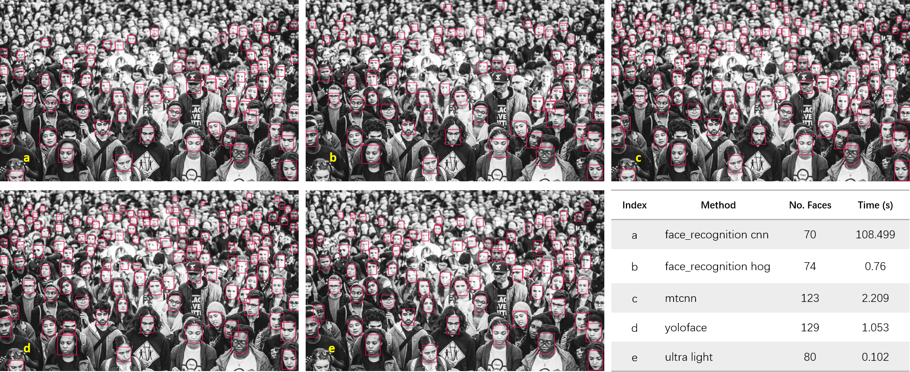

# face_detection

### face detection with multiple methods
- [faced](https://github.com/iitzco/faced) (a customized face detection model)
- [face_recognition](https://github.com/ageitgey/face_recognition) (python face_recognition package)
- [mtcnn](https://github.com/ipazc/mtcnn) (Multi-task Cascaded Convolutional Networks)
- [an ultra-light model](https://github.com/Linzaer/Ultra-Light-Fast-Generic-Face-Detector-1MB) (1M ultra small model)
- [yoloface](https://github.com/sthanhng/yoloface) (a face detector based on yolov3)

#### Real time face + 5 facial feature points detection on webcam:
Run ultra_light_webcam.py:

#### TODO:
- [X] test code
- [X] provide model links
- [X] add descriptions to methods
- [X] add links and references
